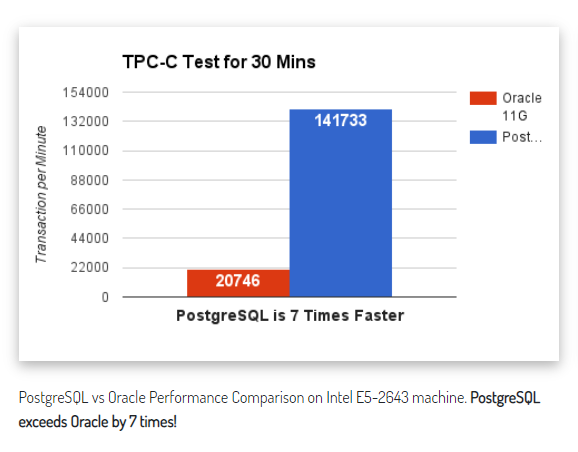
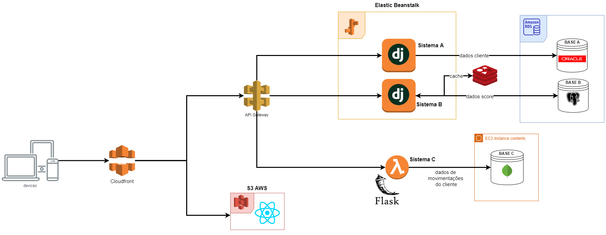

# Sample AWS

Levando em consideração o problema de alto volume e complexidade dos dados é necessário uma arquitetura que 
ofecere uma alta disponibilidade e escalabilidade, com isso o AWS é um ambiente cloud maduro que oferece
uma série de soluções que ajudam na resolução de problemas nesse cenário.

## Armazenamento

O serviço Amazon RDS é uma boa alternativa para os bancos de dados, esse serviço fornece capacidade econômica e redimensionável para banco de dados relacional padrão do setor e gerencia tarefas comuns de administração de banco de dados.

### Base A

A **[Oracle](https://www.oracle.com/br/security/database-security/)** é reconhecido como um dos *databases* que possui um dos maiores ecossistema focado em segurança, 
inclusive nomeada como lider na [KuppingerCole Leadership Compass for Database](https://www.oracle.com/br/a/ocom/docs/database=and-big-data-security.pdf)

### Base B

O banco **PostgreSQL** oferece uma melhor perfomance em relação ao **Oracle**, de acordo com o *bechmark* do *http://tpc.org/*. Além disso o ecossistema para *[machine learning](https://wiki.postgresql.org/wiki/Ecosystem:Machine_learning)* é bem desenvolvido.



### Base C

o [MongoDB](https://docs.mongodb.com/manual/introduction/) é um banco *NoSQL* que dar alta performance para consultar dados em formato JSON e assim uma boa alternativa para armazenar eventos.

## Tráfego

Usando o **Elastic Beanstalk** podemos reduz a complexidade do gerenciamento, o maior beneficio é a facilidade de escalabilidade, provisionamento de capacidade e o balanceamento de carga. Utilizando o serviço **API Gateway** da **AWS** podemos facilitar a disponibilidade dos microserviços.

### Sistema A

Serviço é em python/DRF, como vai ser responsável por manipular dados sensíveis um framework com uma boa interface de segurança e um ORM maduro é o ideal, e o DRF oferece isso.

ex: **Listagem de Clientes**

GET `/clientes`

```JSON
{
    "count": 1023,
    "next": "/clientes/?page=2",
    "previous": "/clientes/?page=1",
    "results": [
        {
            "id":"",
            "nome": "",
            "cpf": "",
            "data_nascimento":"",
            "sexo":,
            "estado_civil":"",
            "endereco":{
                "uf": "",
                "cidade":"",
                "bairro":"",
                "longadouro": "",
                "numero": ,
                "complemento":""
            },
            "dividas": [
                {
                    "empresa":"",
                    "valor": 0.0,
                    "vencimento": ""
                },
                {
                    "empresa":"",
                    "valor": 0.0,
                    "vencimento": ""
                }
            ]
        }
    ]
}
```

Ainda seria possível filtrar por diferentes informações, como nome, cpf, etc.

GET `<rota_s1>/clientes?nome=<string>&cpf=<string>`

### Sistema B

Serviço B também em python/DRF, vai ser responsavél pelo dados do *score*
ex: **Listagem de Clientes**

GET `<rota_s2>/clientes/{id}/score-data`

```JSON
{
    "cpf": "",
    "data_nascimento":"",
    "endereco":{
        "uf": "",
        "cidade":"",
        "bairro":"",
        "longadouro": "",
        "numero": ,
        "complemento":""
    },
    "fontes_de_renda": [
        {
            "tipo": "",
            "descricao":"",
            "valor": 0.0,
            "frequencia":""
        },
        {
            "descricao":"",
            "tipo": "",
            "valor": 0.0,
            "frequencia":""
        },
    ],
    "bens":[
        {
            "tipo": "",
            "valor_estimado":0.0,
            "descricao":""
        },
        {
            "tipo": "",
            "valor_estimado":0.0,
            "descricao":""
        }
    ]
}
```

Para uma melhor peformance na consulta desses dados e do resultado do cálculo do *score* pode ser utilizado o *[REDIS](https://redis.io/)*, um armazenamento de estrutura de dados em memória, assim com esses dados em *cache* teremos uma resposta mais rápida nesse serviço.

### Sistema C

O serviço C pode ser utilizado **AWS Lambda**, assim economizar recurso e utilizar apenas para quando consultar os dados de movimentação de algum CPF,
 o *Flask* é um microframework Python para construir rapidamente um serviço que lista os dados armazenados no MongoDB

GET `<rota_s3>/clientes/{cpf}/consultar`

```JSON
{
    "ultima_consulta": {
        "empresa": "",
        "data_consulta": "",
        "tipo_empresa": ""
    },
    "movimentacao_financeira": {
        "tipo_movimentacao":"",
        "data_movimentacao": "",
        "valor":0.0,
        "descricao": ""  
    },
    "ultima_compra": {
        "data_compra": "",
        "valor": 0.0,
        "bandeira_cartao": "",
        "produto": "",
        "tipo": "",
        "codigo_transacao":""
    }
    
}
```

## Disponibilização dos Dados

É possível criar uma aplicação WEB em React para disponibilizar as informações, é possível disponibilizar o *build* no **AWS S3**

## Arquitetura Microserviço na AWS

*obs: Clique para expandir a imagem:*

